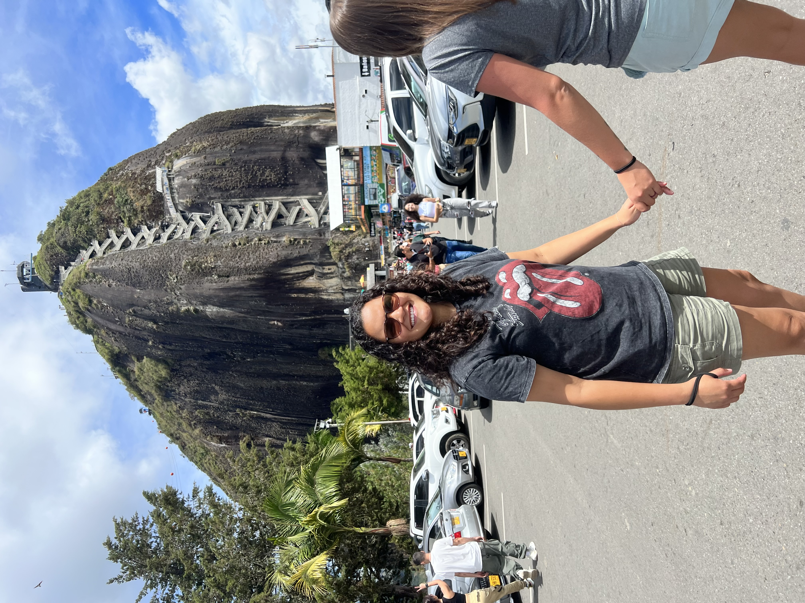

```{r setup, include=FALSE}
knitr::opts_chunk$set(echo = FALSE, message = FALSE, warning = FALSE)
```


### Hi, my name is Lauren Silvatti 
I was born and raised in Barranquilla, Colombia. After graduating high school in 2014, my mother decided that moving to the USA was the best thing she could do for my little brother and me. Though I left my country from a relatively young age, my love for Colombia runs deep. Colombia is a land of immense beauty, with a rich culture and biodiversity that is unparalleled. Our culture is a unique blend of indigenous, African, and Spanish influences, which can be seen in everything from our music and dance to our food and art. My roots are a big part of me and I am very proud of my ascendance. 

```{r,out.length=500,out.width=400}

```


The transition was not easy. I faced language and culture differences that challenged me to adapt and grow. As a minority in this country, I have had to navigate the complexities of the legal immigration system, which were an ongoing struggle for the fisrt 4 years of living here.

Despite these challenges, I am proud to say that my hard work has paid off. I was awarded the NSF S-STEM fellowship at Utah Valley University. This is a full-ride scholarship with research funding. I am incredibly grateful for this opportunity and excited for what the future holds.
Currently, I am conducting research in the neuroscience department and am eager to continue learning and expanding my knowledge. 

```{r,out.length=500,out.width=400}
knitr::include_graphics("../media/853a6825-2e55-4941-81a5-fe4f90d0a0b5.jpg")
```


Aside from my academic pursuits, I have a passion for traveling and have been fortunate enough to visit many countries. My goal is to visit all, or at least most, of the countries in the world by the time I turn 40. There is something truly magical about exploring new cultures, meeting new people, and discovering new places. For me, traveling is not just a hobby or a way to escape from everyday life, but it is a way to broaden my horizons and gain a deeper understanding of the world.

```{r,out.length=500,out.width=400}

```

Last but not least, My wife. The love of my life and the reason I have come to be the person I am. Having her by my side has made all of life's challenges and adventures even more meaningful. Whether it's traveling the world, pursuing my academic and professional goals, or simply navigating the ups and downs of everyday life, having someone who supports and encourages my crazy mind can make all the difference.

