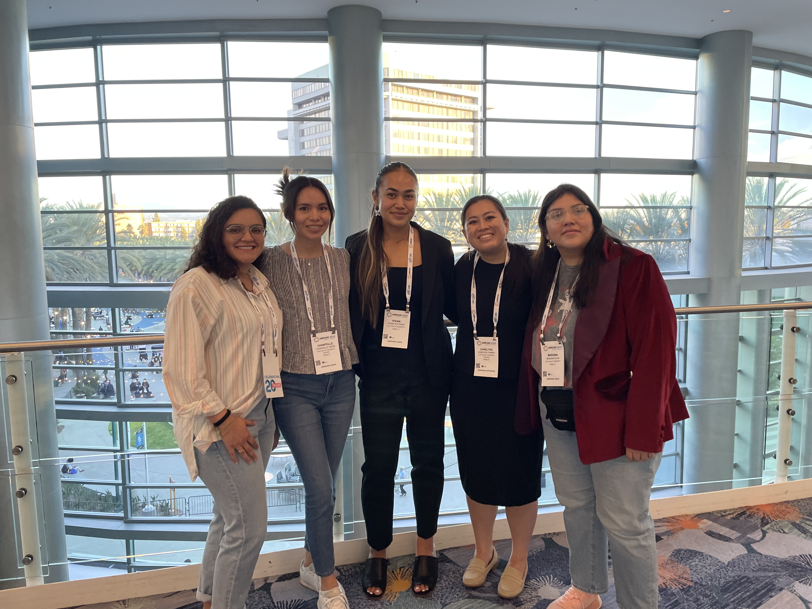

```{r setup, include=FALSE}
knitr::opts_chunk$set(echo = FALSE, message = FALSE, warning = FALSE)

```

## ABRCMS

The experience of attending a national conference was a crucial learning opportunity for me. It was a chance to step outside my comfort zone, interact with a diverse group of peers, and learn about various academic programs and career paths. This conference gave me the chance to learn about opportunities I did not know existed, such as the gap year programs offered by a lot of competitive universities. I gained insights into the MD-PhD route and the benefits it could offer if medical school was my ultimate focus. However, I learned that there are other ways to do human-related research besides going to medical school. These newfound insights have opened up new possibilities for me, and they have given me a clearer vision of the path I want to pursue in my academic and professional life.

```{r,out.length=500,out.width=400}

```   