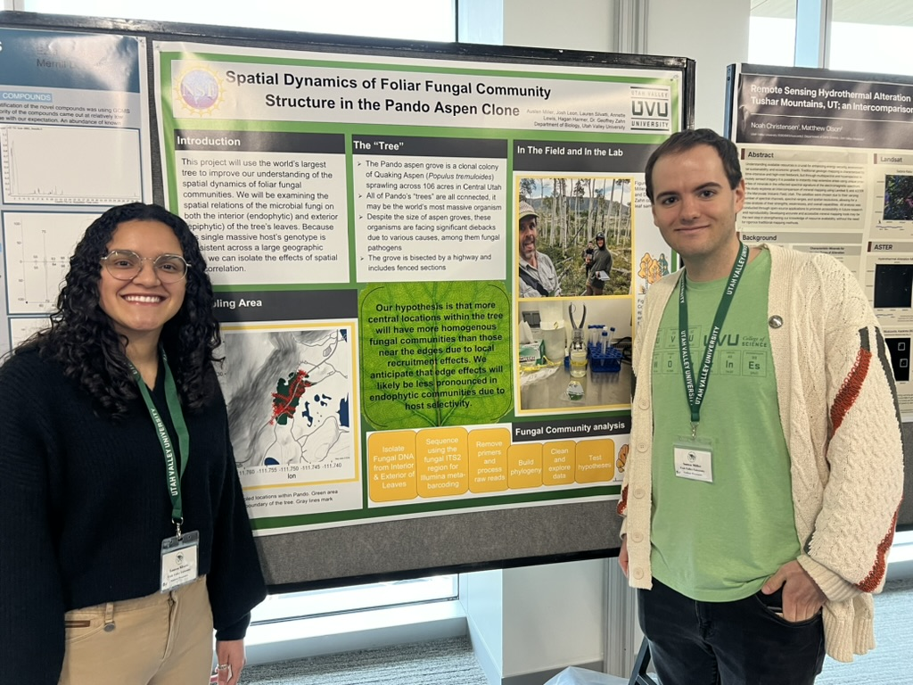

```{r setup, include=FALSE}
knitr::opts_chunk$set(echo = FALSE, message = FALSE, warning = FALSE)

```

## Utah Conference for Undergraduate Research (UCUR) 
 
Attending the UCUR conferences in both 2023 and 2024 marked significant milestones in my academic journey, offering enriching experiences and insights into diverse fields of research. Presenting my projects alongside peers and experts alike provided a platform to showcase my contributions and engage in meaningful discussions. In the realm of Neuroscience under the guidance of Dr. Zoe Thompson, I explored the fascinating aspects of sexual behavior by comparing Wild-type and Pomc deficient mice, using video recordings and creating R scripts for thorough data analysis and visualization. Concurrently, my involvement in Ecology research, mentored by Dr. Geoffrey Zhan, focused on unraveling fungal interactions within the awe-inspiring Pando, the world's largest living tree. Through collaborative efforts, I developed R scripts facilitating data analysis and visualization tasks, culminating in contributions to a forthcoming scientific publication. These immersive experiences not only enhanced my technical skills but also fostered a sense of curiosity and passion for interdisciplinary exploration, guiding my academic and professional journey with renewed enthusiasm.

```{r,out.length=500,out.width=400}

```   

___

## Annual Biomedical Research Conference for Minoritize Scientists (ABRCMS) - 2022

The experience of attending a national conference was a crucial learning opportunity for me. It was a chance to step outside my comfort zone, interact with a diverse group of peers, and learn about various academic programs and career paths. This conference gave me the chance to learn about opportunities I did not know existed, such as the gap year programs offered by a lot of competitive universities. I gained insights into the MD-PhD route and the benefits it could offer if medical school was my ultimate focus. However, I learned that there are other ways to do human-related research besides going to medical school. These newfound insights have opened up new possibilities for me, and they have given me a clearer vision of the path I want to pursue in my academic and professional life.

```{r,out.length=500,out.width=400}
knitr::include_graphics("../media/IMG_5854.jpeg")
```   